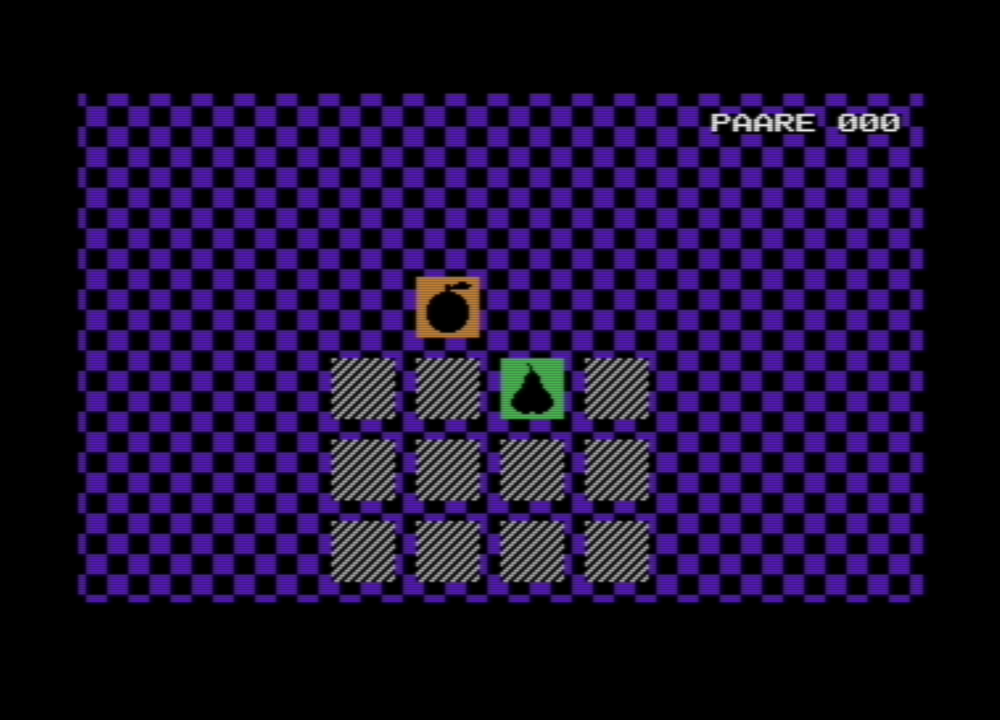

# Pairfinity

Endlos-Memory für den Commodore 16. Läuft auch auf dem Plus/4.

Im Browser spielen: https://phausser.github.io/c16-pairfinity/



## Bauen

Nötig sind [ACME](https://sourceforge.net/projects/acme-crossass/), Python 3 und [VICE](https://vice-emu.sourceforge.io/).

```
make           # baut memory.prg
make run       # startet es in VICE als C16
make preview   # zeigt alle Früchte aufgedeckt
make lint      # baut und prüft Stil, Labels und Speicher
```

## Steuerung

Joystick in Port 1 oder Pfeiltasten. Feuer, Leertaste oder Return startet und deckt Karten auf. Zwei ungleiche Karten bleiben offen, bis eine Cursortaste kommt.

Regeln und Aufbau stehen in [SPEC.md](SPEC.md), der Fortschritt in [TODO.md](TODO.md).

## Lizenz

MIT (siehe `LICENSE`).
